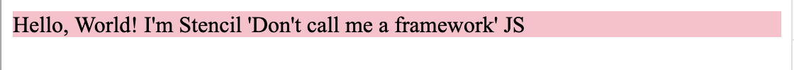

# Stencil dev server CSS reload reproduction

This repo provides a reproduction case for an issue with an interaction between
the Stencil dev server and the `dist-hydrate-script` output target.

## Reproduction steps

To reproduce do the following to get the repo cloned and running:

```sh
git@github.com:alicewriteswrongs/stencil-hmr-hydrate-repro.git
cd stencil-hmr-hydrate-repro
npm install
npm start
```

Then check out the page that opens in the browser. You should see a test
component that looks like this:



Now fire up your editor and open
`src/components/my-component/my-component.css`, the CSS file for that
component. It should look like this:

```cs
:host {
  display: block;
  background: pink;
}
```

Ensuring that you leave the dev server open and running, make an edit to that
file to change the background color, perhaps like this:

```diff
diff --git a/src/components/my-component/my-component.css b/src/components/my-component/my-component.css
index a67d1ca..b67cf28 100644
--- a/src/components/my-component/my-component.css
+++ b/src/components/my-component/my-component.css
@@ -1,4 +1,4 @@
 :host {
   display: block;
-  background: pink;
+  background: black;
 }
```

Now check out the browser again. You should see something like this:


If so, congrats, you've successfully reproduced the issue! 🎉

## What's the issue, exactly?

We changed the CSS in the file to update the background color. That should have
caused the CSS applied to the component to update in place, changing the
background color from pink to black. Instead, the CSS sent to the browser was
garbled, looking something like this:

```css
/*!@:host*/.sc-my-component-h{display:block;background:black}
```

The `.sc-my-component-h` selector doesn't correspond to anything, so this CSS
string, overriding the correctly-formed one applied on page load, causes our
component to lose all of its styling.
